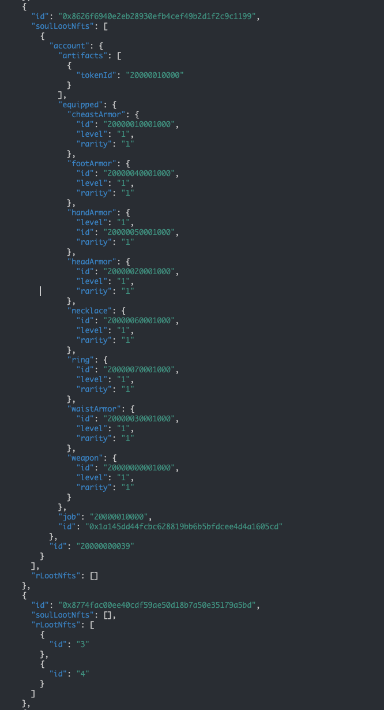

# Loot Adventure Backend Dev Guide

## Description

We are developing a roguelike game using Unity. This game incorporates MCHVerse - Loot by Rogue NFT assets, converting them into our proprietary ERC6551 assets for use within Unity. For the integration with XPLA, we aim to create an Artifact NFT, designed to influence the in-game status.

## Deployed Addresses

### MCH VERSE

Please check the following addresses here

https://explorer.oasys.sand.mchdfgh.xyz/

Contract | Address
----|-----
SoulMinter.sol|0x24F5C92d48309a591a87031f55F6802F53189cC3
SoulControler.sol|0xF341667f7EcEE52B261A1dB70897F636aAb5A9cb
ERC6551Registry.sol|0x96D93c1522FC8C7461B7b0a4E20D67FcD9b5f4Ce
ERC6551Account.sol |0xA9043Ed336130dE936eEa091c4d3b1bE8c418c13
SoulLootNft.sol    |0x9C63cCCF43eb5207564C7E2981AA4FD4F2cCD9D3
SampleLoot.sol     |0x1020B0e03C054900Ed0A6db7b0AFa82a38934E19
EquipmentNft.sol   |0x8207742A621b876C87B2836eBe14bDf11cC88Ef7
JobNft.sol         |0x1559a6F757e981d71A1104ED6Be6Bac970727D81
ArtifactNft.sol    |0x0D43baab2EACfeD484b0070E571Faf886Fab5A45
LaCoin.sol         |0x26b745A62675DfE4D7191c19E234cebDad40CcAB

### XPLA

https://explorer.xpla.io/testnet/address/0x15e4294eA33f19828eCA2B6B2B867aBf0C2509f8

This is NFT Artifact contract which has simple minting function.
This is SBT and one mint per one address.

In Unity game, if user account has this artifact, it gives 10% atk increase.

## DEV GUIDE

Our Unity code is currently somewhat proprietary and complex to execute locally. Therefore, we plan to concentrate on the DEV GUIDE on smart contract aspect.

The information mentioned above has already been communicated with both the Oasys and XPLA teams.

### Requirements/Environment
- nodejs (v18.17.1)
- I'm running on this in MacOS environment

### Install

Please git clone this repository, then

```
cd 10_contrat
npm i
```

### Build

```
// at ./10_contrat
npx hardhat compile
```

### Test

Test part is the same with Execute part, our team is using below command to test the contract.
So please see the detailed execute process at the below.

### Execute

Please set private key by the blow command.

```
export PRIVATE_KEY=<your private key to test>
```

#### MCH Verse
```
// at ./10_contrat
npx hardhat run scripts/mock/deployTToken.ts --network mchTest
```

This command gives you the deployed contract addresses.

Then set the following env

```
export TREASURY=your key to manage fund
export SAMPLE_LOOT=deployed token address
export SOUL_MINTER=deployed token address
export SOUL_CONTROLER=deployed token address
export EQUIPMENT_NFT=deployed token address
export SOUL_LOO=deployed token address
export ERC6551_REGISTRY=deployed token address
```

Since you are running this in testnet, so you are required to mint sample token here. This is replaced actual MCHVerse Loot by Rogue NFT in the production environment.

```
npx hardhat run scripts/01_mint_sample_loot.ts --network mchTest
```

Then run the following scripts.

```
// change token Id to minted token then run
npx hardhat run scripts/02_approve_sample.ts --network mchTest

// change token Id to minted token then run
npx hardhat run scripts/03_mint_soul_loot.ts --network mchTest
```

This give you the required NFT for the game play.

The Unity game part fetch data through the graph, if you want to test the backend data response, try the following.

Start the graph node in local environment.

```
// at 30_backend/02_SubGraph
cp .env.simple .env
docker-compose up
```

Then deploy subgraph to the node.
```
// at 30_backend/02_SubGraph/subgraph/lootAdventure
npm i
npm run codegen
npm run build
npm run create-local
npm run deploy-local
```

This gives url to fetch the data from subgraph. It contains 
- holding Loot by Rogue assets
- holding converted Soul Loot NFT
  - ERC6551 TBA address associated with the Soul Loot NFT
  - Job/Artifact/Equipment NFT Detail



#### XPLA

```
// at ./10_contrat
npx hardhat run scripts/crosschain/mint-xpla-artifact.ts --network xpla
```

It displays the deployed contract address.
Then set env value by

```
export XPLA_CONTRACT_ADDRESS=<deployed address>
```

It mint the artifact NFT to the signer.


## Live App

The game is deployed here.

https://lootadventure.vercel.app/game/prototype/index.html

Because there is less data in testnet, we are using mock data for the game play.
If you want to try the contract integration with the game, please follow this instruction.

1. Run local subgraph with MCHVerse testnet, and mint Loot by Rogue NFT to the user address. the instruction is kept at DEV GUIDE - MCH Verse section. (Currently, if there is no local subgraph, it uses mock data.)

2. Mint artifact NFT on XPLA network, this instruction is kept at DEV GUIDE - XPLA section.

However, those instructions are for technical reviews, so basic game play does not required this.
